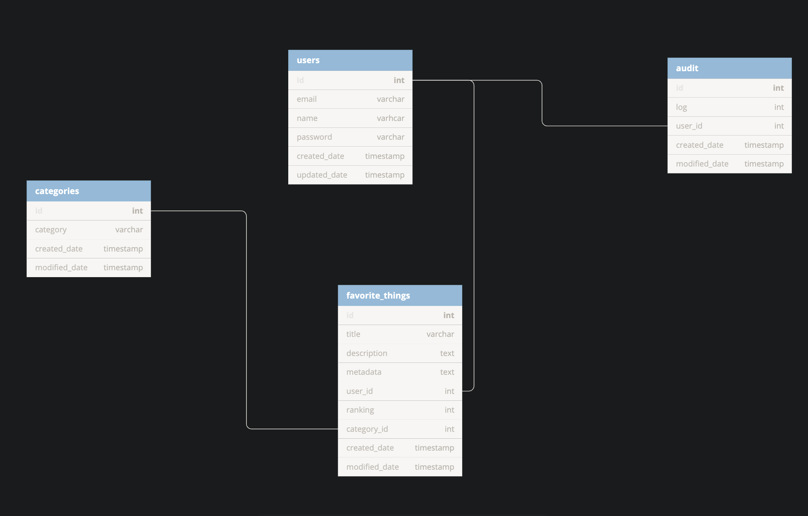

[](https://travis-ci.com/kampkelly/favorite-things)

# Favorite Things Application

### About

This repository is for the Favorite Things application consisting of a  (Flask) backend and a Javascript (Vue) frontend. The application allows users to create an account and enter their favorite things.

#### Technologies used

- Python (Flask)
- SqlAlchemy
- MySQL
- Graphql
- Docker
- AWS

**The documentation for the api can be found by going to `http://ec2-18-222-181-201.us-east-2.compute.amazonaws.com:7000/api` and checking the GraphQL documentation.**

**The models for the database can be found in the `server/api/models.py` file.**

## Setup and Installation

There are two ways to run the application:

- With Docker (Preferred)
- Without Docker

### Installation with Docker (Development)

1. First make sure Docker is installed on your machine.
2. Create two .env files, one in the project root directory and one in client folder using their respective .env.sample files (modify the values as needed such as APP_SETTINGS).
3. Then in the project root directory, run `make build`.
4. You should then be able to access the application via these urls:

- `http://localhost:7000` for backend API
- `http://localhost:8080` for frontend

### Installation without Docker

##### For backend API

1. Create a .env file in the project root directory using the sample from .env-sample.
2. Install virtualenv with `pip install virtualenv`.
3. Create a virtual environment with `virtualenv venv` and activate with `source .env` in the root directory.
4. Run `cd server` and `pip install -r requirements.txt`.
5. Run `python server/server.py`.
6. Access the server on `http://localhost:7000/api`.

##### For frontend

1. Create a .env file in the client directory using the sample from client/.env-sample.
2. Run `cd client`.
3. Run `npm install`.
4. Run `npm run serve`.
5. Access the client on `http://localhost:8080`.

##### Database Entity Relationship Diagram



# How to deploy this application

#### (Steps 1 - 3 apply only to AWS using cloud formation. If you have cloned the repository already to your own hosting server, please proceed to step 4)

1. Download ec2single_instance.yml from the repo or cd into the repo and run the command below replacing "myaccess" with your KeyName value. *The command will create a stack and an EC2 instance which will be used to host the application*.

**N.B: you will have to configure `aws` cli on your computer**

```
aws cloudformation create-stack --template-body file://ec2single_instance.yml --stack-name single-instance --parameters ParameterKey=KeyName,ParameterValue=myaccess ParameterKey=InstanceType,ParameterValue=t2.micro
```

Go to AWS Cloud formation console to check that the stack has been created. Then go to the EC2 instance and get the public ip.

2. SSH into your server: `ssh -i ~/.ssh/yourkeypair.pem ec2-user@"IP"`.

    Replace `yourkeypair` with your keyname value.

3. Depending on your Linux server, if git and docker are already installed, you can skip this step. Otherwise, install them.

For the above AWS ec2instance, you may need to run the commands below to install them:

 ```
sudo su
yum install -y git
yum install -y docker
service docker start
usermod -a -G docker ec2-user
curl -L https://github.com/docker/compose/releases/download/1.23.2/docker-compose-`uname -s`-`uname -m` | sudo tee /usr/local/bin/docker-compose > /dev/null
chmod +x /usr/local/bin/docker-compose
ln -s /usr/local/bin/docker-compose /usr/bin/docker-compose
```

#### For any hosting server

4. On your hosting server after you ssh into it, clone the repository, `git clone https://github.com/kampkelly/favorite-things.git` and `cd favorite-things` into it.

5. Create two .env files, one in the project root directory and one in the client folder using their respective .env.sample files (modify the values as needed such as APP_SETTINGS).

    `nano .env`

    `nano client/.env`
6. Then run the following command: `make release` from the project root directory.

7. You should then be able to access the application via these URLs:

- server_url:7000/api for backend API

- server_url:8080 for frontend
**
- **N.B**: remember to configure the above ports in your server to accept incoming requests. (For AWS: this can be found in Security Groups.)

```
The deployment details for what is happening under the hood during deployment can be found in Makefile and the docker/release folder.
```

For subsequent updates to the application, just run:

```
git pull
make release
```

#### Steps taken to autolint the code

For the Python code:

 Flake8 is used for the python code following PEP8 coding conventions. The setup for the Flake8 can be found in setup.cfg when running directly with `pytest`. A similar setup can also be found in tox.ini when running the tests with `tox`.

For the Client in Javascript:

Eslint using the airbnb style guide is used. There is also a `.eslintrc` file in the client folder for additional configuration.

### My approach to building this application

This full stack application was developed with Flask, SqlAlchemy and GraphQl for the backend API while Vuejs, HTML and SCSS was used for the frontend. Choice of the database is MySQL. The application can be hosted on any Linux server (prefererably AWS ec2 instance).

**Reordering of favorite things:**
The app allows users to rank their favorite things when entering them. So there is a reordering of the users favorite things for a category whenever the user adds or updates a favorite. This also happens when a favorite thing is deleted.

When starting the project:

- I designed the database entity relationship diagram.
- Created user stories on Trello for the project.
- Created a Github repository.
- Started working on the features (using Github feature branching).

The whole application is containerized with Docker.
Using Docker I have two images:

- one for MySQl databsae
- one for the app (backend and client)

Then there are also several containers for each service (api, client and database).
One major advantage of using docker is to have a consistent and reliable environment for running the application in any hosting server.

## Running Tests

#### With Docker (Preferred)

On the project root directory, run `make test`.

#### Without Docker

- Change APP_SETTINGS in .env to testing.
- Activate virtualenv with `source .env`
- cd into the server folder
- Install requirements with `pip install -r requirements.txt`
- Run `tox`
