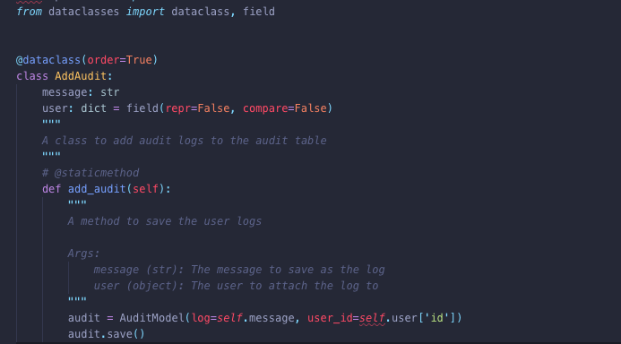
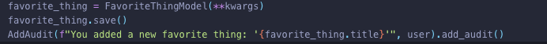

#### Hours spent on the challenge
Approximately 71 hours

#### Feature to add

If I had more time on this coding challenge, I would add support for caching with Redis. So when a user sends a request, the cache is checked for its availability. If it is not found, then it will be fetched from the MySQL database, stored in the cache and sent to the user.

The next time the user requests for that same data, the cache will be checked. When found it will return it back to the user instead of proceeding to query the database once more and perform possibly complex queries. This will improve the speed and responsiveness of the application.

N.B: One thing to be aware of is changes in the database. This can be handled by updating the cache when there is a change to the database and also setting an expiry time for the cached data. If this is not done, then there is a risk of serving old data to the user.

#### A new important feature in Python 3.7

- `Data Classes`

One of the most important feature added to Python 3.7 is **data classes**. This make it easy to write classes as the special methods .__init__(), .__repr__(), and .__eq__() are added automatically. Also by making use of dataclasses, you will have to make use of type annotations (i.e stating the type of each variable).

Below are two screenshots of data class in use. The `field(repr=False, compare=False)` added to user in `fig 1` means user should not be returned when getting the `repr` of this class.

`writing a dataclass (fig 1)`

`calling a dataclass (fig 2)`

#### Tracking down a performance issue in production

There are a number of ways this can be addressed:

- Using a Infrastructure monitoring and application performance monitoring tools such as NewRelic to collect data about my infrastructure such as CPU, ram usage, response times, etc.  This will help to narrow down the cause of the performance issue.

- Integrating a tool like Bugsnag to collect application error logs.

- Monitor where bulk of the requests are coming in from and observing the time spent in loading assets such as images and Javascript files.

- Developer tools such as chrome can also be used to test the application such as adjusting the internet speed in the Google Chrome Network tab to test how the app behaves on slow networks.

While I have not had a major performance issue in any of my hosted application, I have previously made use of Bugsnag and NewRelic.
